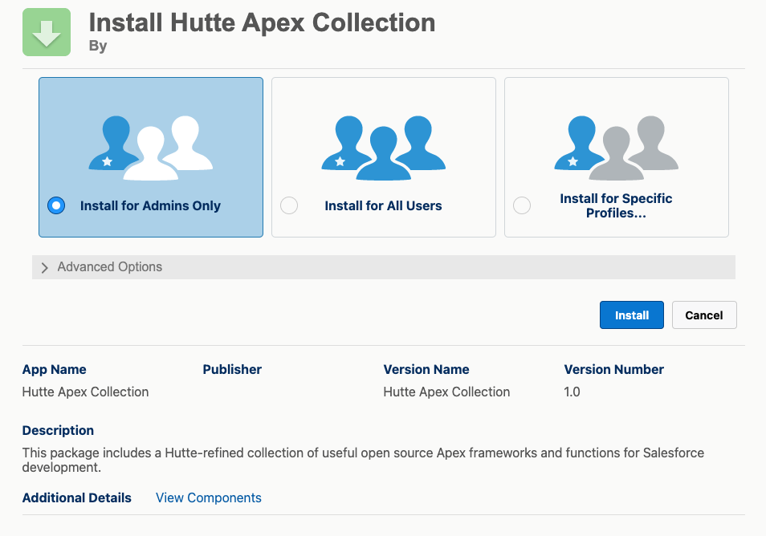

# Hutte Apex Collection

## What does it include?

Hutte Apex Collection is a set of useful open source Apex frameworks for Salesforce development, built by contributors in the Salesforce community

These are:

- [Apex Trigger Actions](https://github.com/mitchspano/apex-trigger-actions-framework)
- [Amoss - Apex Mocks](https://github.com/bobalicious/amoss)
- [Nebula Logger](https://github.com/jongpie/NebulaLogger)
- [SOQL-Lib](https://github.com/beyond-the-cloud-dev/soql-lib)
- [Apex Domain Builder](https://github.com/rsoesemann/apex-domainbuilder)
- [Apex Http Mocks](https://github.com/rsoesemann/apex-httpmock)

## Why to create a Collection?

While these can be deployed (or even installed as an unlocked package) independently, Hutte provides these bundled in an Unlocked Package to set a project baseline in a single-installation. Besides, this Hutte collection can be extended with new open source frameworks (either by Hutte or external contribution) and new versions of this unlocked package can be created.

## Considerations

As a baseline, these frameworks cover the basics of a Salesforce implementation, for example, a Apex triggers management using [Apex Trigger Actions](https://github.com/mitchspano/apex-trigger-actions-framework), a logging system with [Nebula Logger](https://github.com/jongpie/NebulaLogger) or a SOQL light-weight library with [SOQL-Lib](https://github.com/beyond-the-cloud-dev/soql-lib), among others.
This collection is not currently including many other valuable frameworks existing in the open source community to keep it simple in initial versions.
Besides, while creating this collection, it's prioritized to use frameworks that use the newest features of apex development, such as [user mode](https://developer.salesforce.com/docs/atlas.en-us.apexcode.meta/apexcode/apex_classes_enforce_usermode.htm), and are as simple and complete as possible.

## Contributions

External contributions are welcomed, either through Pull Request, Github Issues or any other feasible alternative.